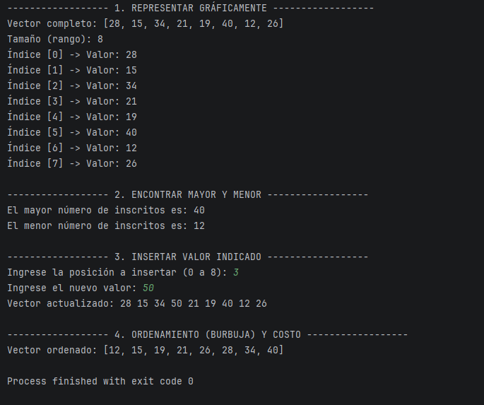
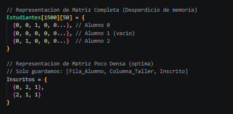

# README — Evaluación

> **Curso:** ALGORITMO Y ESTRUCTURA DE DATOS BASADOS EN INTELIGENCIA ARTIFICIAL  
> **Código:** 4682  
> **Evaluación:** PA1  
> **Equipo:** Grupo 4

## 1. Integrantes

| Integrante | Rol | Aporte principal |
|---|---|---|
| Victor Manuel Fabricio Quispe Gonzales | Analista | Resolución de la Actividad 4 |
| Geraldine Khatrina Tudela Theo | Desarrolladora | Resolución de la Actividad 2: Modelado, algoritmos de búsqueda (mayor/menor), inserción y ordenamiento (Burbuja) en vectores. |
| Luis German Guerrero Peña | Analista | Resolución de la Actividad 1: Análisis del problema y selección de estructura. |
| Mijail mendoza chavez | programador |diseño de la matriz, elaboración de algoritmos de recorrido, cálculo de totales, identificación de la mayor ocupación y desarrollo/prueba del código Java |

## 2. Descripción y objetivo

**Problema:**  
[Describir brevemente el problema trabajado.]

**Objetivo:**  
[Indicar qué busca resolver el proyecto.]

**Solución desarrollada:**  
[Explicar brevemente la solución implementada.]

## 3. Cómo ejecutar o revisar

```bash
# Escribir aquí los comandos necesarios
```

**Pasos de revisión:**
1. [Paso 1]
2. [Paso 2]
3. [Paso 3]

> No publicar contraseñas, tokens, credenciales ni datos sensibles.

## 4. Evidencias

Agregar aquí capturas, resultados, pruebas o enlaces que demuestren el funcionamiento.

- [Evidencia 1]
- Actividad 2 (Vectores):
  
- Actividad 4 (Matrices especiales):
  

## 5. Matriz de participación

| Integrante | Desarrollo | Pruebas | Documentación | Exposición | Evidencia de participación |
|---|---|---|---|---|---|
| [Nombre 1] | [Alta/Media/Baja] | [Alta/Media/Baja] | [Alta/Media/Baja] | [Sí/No] | [Commits, avances, etc.] |
| Geraldine Khatrina Tudela Theo | Alta | Alta | Media | [Sí/No] | [Commits, avances, etc.] |
| Luis German Guerrero Peña | Media | Media | Media | [Sí/No] | [Commits, avances, etc.] |
| Mijail mendoza chavez | alta | alta| media | [Sí/No] | Desarrollo de la Actividad 3, código Java, pruebas de ejecución y aporte al README |
| [Nombre 5] | [Alta/Media/Baja] | [Alta/Media/Baja] | [Alta/Media/Baja] | [Sí/No] | [Commits, avances, etc.] |

## 6. Video de exposición

**Video público de YouTube:** [PEGAR AQUÍ EL ENLACE]

Todos los integrantes deben participar en la exposición con sus cámaras prendidas y explicar el procedimiento, la solución desarrollada y las decisiones tomadas.

## 7. Conclusiones

- [Conclusión 1]
- [Conclusión 2]
- [Conclusión 3]

---

**Última actualización:** [22/09/2026]
